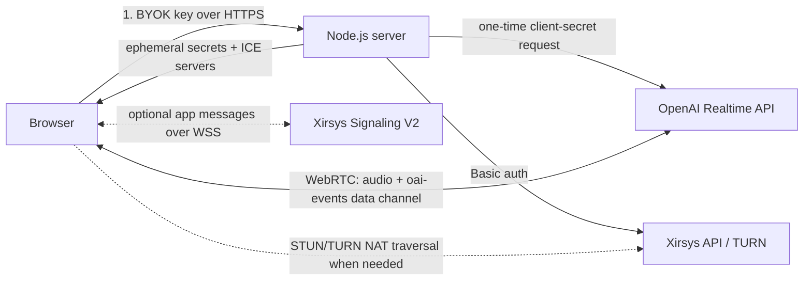

# OpenAI Realtime Voice with WebRTC and Xirsys

A small TypeScript/Node.js SDK and plain HTML/JavaScript demo for a live,
speech-to-speech OpenAI voice agent. The OpenAI connection is **WebRTC only**.
Xirsys provides short-lived STUN/TURN credentials for ICE and NAT traversal, plus
an optional WebSocket application-message channel.

This tutorial intentionally does not use OpenAI's Realtime WebSocket transport.

Public repository: [github.com/xirsys/openai-realtime-xirsys-webrtc](https://github.com/xirsys/openai-realtime-xirsys-webrtc)

Live demo: [demo.xirsys.com/openai-realtime-voice](https://demo.xirsys.com/openai-realtime-voice/)

## Get the source

```bash
git clone https://github.com/xirsys/openai-realtime-xirsys-webrtc.git
cd openai-realtime-xirsys-webrtc
npm install
cp .env.example .env
```

The package is also prepared for a future public npm release as
`@xirsys/openai-realtime-webrtc`, but this repository publication does not
publish it to npm.

## What goes over which transport?



| Concern | Transport | Provider |
| --- | --- | --- |
| Microphone input and agent audio | WebRTC media (SRTP) | OpenAI |
| Realtime JSON events | WebRTC data channel (`oai-events`) | OpenAI |
| NAT discovery and media relay | STUN/TURN ICE candidates | Xirsys |
| Optional browser-to-browser app messages | WebSocket Signaling V2 | Xirsys |
| Tester OpenAI key | One HTTPS bootstrap request; never persisted | Demo server |
| Xirsys long-lived credentials | Server environment only | Your Node server |

The Xirsys WebSocket does **not** carry OpenAI audio, OpenAI events, or the SDP
answer. OpenAI is not a peer in a Xirsys signaling channel. The browser posts its
SDP offer directly to OpenAI using a short-lived client secret.

## Prerequisites

- Node.js 18 or newer
- An OpenAI API key with Realtime API access
- A Xirsys account and an existing channel
- A browser with WebRTC and microphone support
- `localhost` during development or HTTPS in production (microphone access
  requires a secure context)

## 1. Configure the server

Install dependencies and copy the environment template:

```bash
npm install
cp .env.example .env
```

Set these required Xirsys values in `.env`:

```dotenv
XIRSYS_IDENT=your-xirsys-ident
XIRSYS_SECRET=your-xirsys-secret
XIRSYS_CHANNEL=your-channel-name
```

The sample defaults to `gpt-realtime-2.1` and the `marin` voice, matching the
current OpenAI WebRTC examples when this tutorial was written. Both are
configurable:

```dotenv
OPENAI_REALTIME_MODEL=gpt-realtime-2.1
OPENAI_REALTIME_VOICE=marin
OPENAI_REALTIME_INSTRUCTIONS=You are a concise, friendly voice assistant.
```

The public demo intentionally has no server-side `OPENAI_API_KEY`. Each tester
enters their own key in a password field. The page sends it once over HTTPS to
the Node server, which uses it only to mint an ephemeral Realtime token. The key
is not written to disk, logs, browser storage, cookies, or the URL.

This BYOK flow is a demo-specific trust tradeoff: the tester must trust the page
and server with their standard key during that exchange. OpenAI's production
guidance is to keep standard API keys on a trusted backend and return only an
ephemeral token to the browser. Use a temporary or restricted project key for
the hosted demo and revoke it afterward. Never expose the server's Xirsys
credentials to the browser.

## 2. Run the voice agent

```bash
npm run dev
```

Open [http://localhost:3000](http://localhost:3000), enter an OpenAI API key with
Realtime access, select **Connect microphone**, grant microphone permission, and
speak. The OpenAI server's voice activity detection handles turn-taking by
default.

The connection runs in this order:

1. The browser asks for microphone permission.
2. `POST /api/bootstrap` uses the tester's key once to ask OpenAI for an
   ephemeral Realtime client secret and asks Xirsys for `webrtc=1` ICE servers.
3. The browser creates `RTCPeerConnection({ iceServers })`, adds its microphone,
   and creates the `oai-events` data channel.
4. It creates an SDP offer and waits for ICE gathering. This wait is important:
   OpenAI uses a single non-trickle SDP exchange, so Xirsys relay candidates need
   time to appear in `localDescription`.
5. The browser posts the SDP to `https://api.openai.com/v1/realtime/calls` with
   the ephemeral key and installs OpenAI's SDP answer.
6. Audio flows as WebRTC media. Client and server Realtime events flow as JSON
   over the data channel.

## 3. Use the SDK pieces

### Node.js: OpenAI client secrets

The server-side SDK is exported from `src/sdk/index.ts` and emits TypeScript
declarations during `npm run build`.

```ts
import { OpenAIRealtimeClient } from "./src/sdk/index.js";

const openai = new OpenAIRealtimeClient({
  apiKey: process.env.OPENAI_API_KEY!,
});

const clientSecret = await openai.createClientSecret({
  session: {
    type: "realtime",
    model: "gpt-realtime-2.1",
    instructions: "You are a helpful voice assistant.",
    audio: { output: { voice: "marin" } },
  },
});
```

Return only the ephemeral `clientSecret.value` to the authenticated browser.
The standard OpenAI API key stays on the server.

### Node.js: Xirsys ICE servers

```ts
import { XirsysClient } from "./src/sdk/index.js";

const xirsys = new XirsysClient({
  ident: process.env.XIRSYS_IDENT!,
  secret: process.env.XIRSYS_SECRET!,
  channel: process.env.XIRSYS_CHANNEL!,
});

const iceServers = await xirsys.getIceServers({
  expiresInSeconds: 60,
});
```

The SDK calls `PUT /_turn/{channel}?webrtc=1&expire=60`, checks both the HTTP
status and Xirsys response envelope, and returns the array ready for
`RTCPeerConnection`. Xirsys's credential lifetime controls how long a new TURN
allocation can authenticate; it does not impose a 60-second call limit.

Geo-routing is opt-in with `XIRSYS_GEO=true`. The sample only forwards a public
IP derived from Express's trusted request context; it never accepts an arbitrary
IP from the request body. Configure `TRUST_PROXY` to match your real deployment
before enabling this behind a proxy.

### Browser: connect and send events

```js
import { RealtimeVoiceClient } from "./sdk/realtime-voice.js";

const client = new RealtimeVoiceClient({
  audioElement: document.querySelector("audio"),
});

client.addEventListener("realtime", ({ detail: event }) => {
  console.log(event.type, event);
});

const openaiApiKey = document.querySelector("#openai-api-key").value;
await client.connect({ openaiApiKey });
```

The class exposes:

- `connect({ openaiApiKey, forceRelay, includeSignaling, peerId })`
- `sendEvent(event)` for any supported Realtime client event
- `sendText(text)` for a text turn followed by `response.create`
- `setMuted(boolean)`
- `getConnectionStats()` to inspect the selected ICE path, including whether it
  is direct or TURN-relayed, candidate protocols, RTT, the Xirsys TURN service
  host/port, and the relay allocation address when the browser exposes them
- `sendSignalingMessage(operation, payload, targetPeerId)` when optional Xirsys
  signaling is enabled
- `disconnect()`

## Data channel example

OpenAI Realtime events are ordinary JSON messages on `oai-events`:

```js
client.sendEvent({
  type: "conversation.item.create",
  item: {
    type: "message",
    role: "user",
    content: [{ type: "input_text", text: "Give me a two-sentence welcome." }],
  },
});
client.sendEvent({ type: "response.create" });
```

WebRTC carries model audio automatically; you do not need to decode audio delta
events as you would with an OpenAI WebSocket implementation.

## Test Xirsys NAT traversal

Normally the browser chooses the best candidate path. A `host` or `srflx` path is
expected on permissive networks and does not indicate an error. TURN is a
fallback for restrictive NATs and firewalls.

Open **Connection events** in the demo for a live diagnostic snapshot. A
`srflx` result is shown as **Direct (STUN-discovered)** because STUN discovers a
publicly reachable address but does not relay the media. A `relay` result is
shown as **TURN relay**, along with the selected Xirsys server and service port,
TURN transport, relay allocation, and round-trip time when those WebRTC stats
are available in the browser.

To prove relay connectivity:

1. Check **Force TURN relay (diagnostic)** before connecting.
2. Connect the session.
3. Confirm the UI reports `relay` as the local candidate type.
4. Test again on the actual mobile, corporate, or restricted network you need to
   support.

Disable relay-only mode for normal production traffic so WebRTC can use a lower
latency direct path when available.

## Optional Xirsys WebSocket signaling

Check **Xirsys WebSocket (Optional)** to demonstrate Signaling V2. The Node SDK
gets a signaling host and a short-lived peer token; the browser connects to
`wss://.../v2/{token}` and sends JSON user packets. It also sends JSON ping/pong
heartbeats every 30 seconds.

When enabled, the Connection events panel reports the sanitized WebSocket
host/port, state, peer ID, and application-message counts. The short-lived
signaling token and URL path are deliberately omitted from diagnostics.

This side channel is useful for presence, room state, coordination between your
own browser clients, or out-of-band UI messages. It is not required for a
browser-to-OpenAI Realtime call because OpenAI's REST/WebRTC endpoint performs
that negotiation.

## Production checklist

- Set `PUBLIC_ORIGIN` to the exact HTTPS origin serving the demo. The sample
  rejects bootstrap requests from other origins when this is configured.
- Tune `BOOTSTRAP_RATE_LIMIT_MAX` and `BOOTSTRAP_RATE_LIMIT_WINDOW_MS` for your
  traffic. The included limiter is per process and intended for a small demo;
  use a shared rate-limit store when running multiple instances.
- Replace this public BYOK input with an authenticated backend-managed OpenAI
  key in a production application. Standard OpenAI API keys should not normally
  be entered into or shipped with browser code.
- Keep Xirsys long-lived credentials on the trusted server.
- Return `Cache-Control: no-store` for short-lived credentials (already done).
- Use HTTPS/WSS outside localhost.
- Derive `OpenAI-Safety-Identifier` from a stable, privacy-preserving backend user
  identifier. Do not trust a value supplied by the browser.
- Use short-lived Xirsys ICE and signaling credentials.
- Do not log authorization headers, client secrets, TURN credentials, or
  signaling URLs containing tokens.
- Close peer connections, data channels, sockets, and microphone tracks on
  disconnect.
- Deploy `/api/bootstrap` near users if initialization latency matters.

## Commands

```bash
npm run dev          # TypeScript server with reload
npm run build        # compile server SDK and app
npm start            # run the compiled server
npm test             # provider-client unit tests with mocked HTTP
npm run check        # type-check, browser syntax checks, and tests
```

## Project map

```text
src/sdk/openai-realtime.ts   OpenAI ephemeral client-secret SDK
src/sdk/xirsys.ts            Xirsys ICE and Signaling V2 SDK
src/server.ts                secure bootstrap endpoint + static server
public/sdk/realtime-voice.js browser WebRTC/data-channel SDK
public/app.js                demo controller
public/index.html            plain HTML client
test/                        mocked provider-client tests
```

## Official references

- [OpenAI: Voice agents](https://developers.openai.com/api/docs/guides/voice-agents)
- [OpenAI: Realtime API with WebRTC](https://developers.openai.com/api/docs/guides/realtime-webrtc)
- [Xirsys API quick reference](https://docs.xirsys.com/xirsys-api.md)
- [Xirsys API introduction](https://docs.xirsys.com/api/introduction)

## License

[MIT](./LICENSE) © 2026 Xirsys LLC
